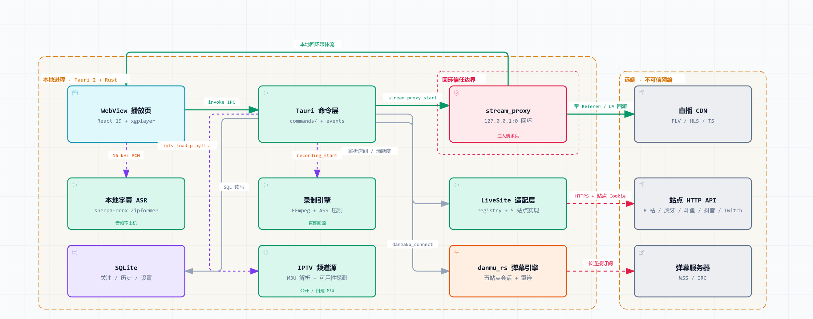

<p align="center">
  
</p>

<h1 align="center">rLive</h1>

<p align="center">
  把多平台直播、弹幕、录制与本地字幕放进一个客户端。
</p>

<p align="center">
  <a href="docs/zh/用户指南.md">使用指南</a> ·
  <a href="docs/README.md">项目文档</a> ·
  <a href="https://github.com/Kenny3Shen/rLive/releases">已发布版本</a> ·
  <a href="https://github.com/Kenny3Shen/rLive/issues">问题反馈</a>
</p>

<p align="center">
  <a href="https://github.com/Kenny3Shen/rLive/actions/workflows/ci.yml"></a>
  
  
  
</p>

rLive 是基于 Tauri 的跨平台直播客户端。它在 Rust 后端统一平台接口、播放源、弹幕协议和本机数据能力，在 React 前端提供一致的浏览、观看与管理体验。

> [!IMPORTANT]
> 项目仍在持续开发，`master` 不等同于已经发布的版本。当前 Windows 本地 release 构建和 FFmpeg 运行库 staging 已验证；Linux 和 macOS 尚未固定并打包 FFmpeg 运行库，因此当前源码版本暂不发布全平台正式 tag。

## 核心功能

| 核心能力           | rLive 提供什么                                                                                                  |
| ------------------ | --------------------------------------------------------------------------------------------------------------- |
| 五站统一入口       | 在哔哩哔哩、虎牙、斗鱼、抖音和 Twitch 之间浏览推荐、分类与搜索，并统一管理关注和观看历史                        |
| 直播专用播放器     | 通过 Rust 本机代理播放 HLS、FLV 和 MPEG-TS，记忆清晰度与线路；遇到协议错误或上游 EOF 时执行有界恢复             |
| 进程内 FFmpeg 录制 | 桌面端最多同时录制 4 路；直播流只重新封装、不转码，默认开启后台录制，支持按关注主播单独启用开播轮询录制、按时长自动分割、磁盘保护、崩溃恢复、退出前确认和本地录制库；弹幕轨可按录制设置中的 ASS 配置导出同名 `.ass`，供 PotPlayer、mpv 等外部播放器加载 |
| 实时弹幕           | 同时提供列表、画面弹幕和 B 站 SC，支持屏蔽、礼物过滤和重复合并；发送能力需要本机登录与显式授权                  |
| 多画面与 IPTV      | 桌面端支持 4 / 6 路布局、拖拽换位、独立音量和直播时钟同步；IPTV 支持公开频道、自有 M3U 和有权使用的 HTTP(S) 直链              |
| 本地字幕与数据     | 使用 sherpa-onnx 在设备上进行流式语音识别；设置、Cookie、关注、历史、模型和录制目录均由用户在本机控制           |

## 平台能力

| 直播平台 | 浏览与搜索                          | 播放 | 实时弹幕                  |
| -------- | ----------------------------------- | ---- | ------------------------- |
| 哔哩哔哩 | 推荐、分类、搜索                    | 支持 | 接收；登录并授权后可发送  |
| 虎牙     | 列表、房间、搜索                    | 支持 | 接收；登录并授权后可发送  |
| 斗鱼     | 列表、房间、搜索                    | 支持 | 接收；登录并授权后可发送  |
| 抖音     | 推荐、分类分页；搜索需要登录 Cookie | 支持 | 接收，不支持发送          |
| Twitch   | 直播、分类、搜索分页                | HLS  | 匿名 IRC 接收，不支持发送 |

弹幕发送默认关闭，仅哔哩哔哩、虎牙和斗鱼提供发送入口。应用只把平台真实回显视为发送成功；账号条件和风险说明见[用户指南](docs/zh/用户指南.md)。

## 系统架构

<p align="center">
  <picture>
    <source media="(prefers-color-scheme: dark)" srcset="docs/assets/architecture-dark.png">
    
  </picture>
</p>

矢量版本见 [architecture.svg](docs/assets/architecture.svg)；可交互版本（主题切换、引导视图、关系追踪）见 [rlive-runtime-architecture.html](docs/diagrams/rlive-runtime-architecture.html)，图形规格为 [rlive-runtime.architecture.json](docs/diagrams/rlive-runtime.architecture.json)。

- **播放路径**：平台 CDN → Rust `stream_proxy` → localhost URL → `xgplayer`。代理负责请求头、跨域访问和 HLS 清单改写；前端编排通用的有界恢复，Twitch 清单恢复由代理配合完成。
- **录制路径**：平台 CDN → 进程内 `ffmpeg-next` / libavformat → 本地录制目录。FFmpeg 只负责桌面录制，不参与前端播放，也不会启动 `ffmpeg.exe` CLI；新录制目录以「平台_房间号」命名，重复录制追加开始时间和序号；可在「设置 → 录制设置」配置 0–1440 分钟自动分割，每段独立发布；活动任务通过 Tauri Event 增量更新录制库，历史 bundle 由可重建的内存索引读取。
- **弹幕路径**：平台协议适配器在 Rust 侧解析并批处理消息，再通过 Tauri Events 推送到列表与画面；录制任务从同一批后端消息直接写入 `danmaku.jsonl`，可按「录制设置 → 导出 ASS 弹幕 → 配置选项」转换为与媒体同名的 `.ass` 滚动字幕。
- **字幕路径**：播放器音频经 Web Audio 转为 16 kHz PCM，通过 `asr_transcribe` 送入本机 sherpa-onnx 会话，识别结果返回字幕层；模型与音频不出本机。
- **IPTV 路径**：`iptv_load_playlist` 下载用户提供或公开的 M3U 播放列表，在 Rust 侧解析并探测频道可用性，播放仍复用 `stream_proxy` 回环。

设置、账号、关注和历史保存在 `rlive.db`；录制媒体、`metadata.json` 与 `danmaku.jsonl` 位于独立录制目录，不写入 SQLite。更详细的模块职责和生命周期见[架构说明](docs/zh/架构说明.md)。

## 客户端支持

| 客户端            | 直播与 IPTV      | 多画面           | 本地字幕                  | 直播录制         | 当前状态                                  |
| ----------------- | ---------------- | ---------------- | ------------------------- | ---------------- | ----------------------------------------- |
| Windows x64       | 支持             | 支持             | CPU / CUDA                | 支持             | 本地 release 构建已验证                   |
| Linux x86_64      | 支持             | 支持             | CPU                  | 支持             | 本地 release 构建已验证                   |
| macOS arm64 / x64 | 代码支持，未验证 | 代码支持，未验证 | CPU，未验证               | 代码支持，未验证 | 尚未完成真机、FFmpeg 打包、签名与公证验证 |
| Android arm64-v8a | 支持             | 不支持           | 不支持                    | 不支持           | API 24 及以上                             |

电视端、iOS、点播视频下载、平台内容离线下载、礼物与支付、批量发送及自动回复不在当前支持范围内。桌面直播录制是独立的本地功能，不等同于平台内容下载服务。

## 获取与使用

已经公开的版本和产物以 [GitHub Releases](https://github.com/Kenny3Shen/rLive/releases) 为准；使用前请同时阅读对应 Release 说明。当前 `master` 包含尚未正式发布的功能，不应根据 README 推断某个平台安装包已经可用。

首次进入应用后：

1. 在顶部选择直播平台，从推荐、分类或搜索进入房间。
2. 在播放器中选择清晰度和线路；右侧栏管理弹幕、关注和显示设置。
3. 需要账号能力时，前往「设置 → 账号」扫码登录或保存 Cookie。
4. 桌面端可从直播间标题栏开始录制，也可在关注页右键主播直接开启后台录制或单独勾选「自动录制」；侧栏提供「多画面」「录制」和「IPTV」，「录制」入口会显示进行中的任务数。录制库顶栏可在「全部 / 录制中 / 已录制」间切换。
5. 录制保存位置可在「设置 → 录制 → 保存位置」修改；切换时会同步迁移已有录制。

完整操作、账号条件、录制格式、IPTV、局域网同步和常见问题见[用户指南](docs/zh/用户指南.md)。

## 从源码开发

### 环境要求

- [Rust](https://www.rust-lang.org/tools/install)、[Bun](https://bun.sh/) 和 [Tauri 2 前置环境](https://v2.tauri.app/start/prerequisites/)
- Rust 构建需要 clang/libclang 供 `quickjs-rusty` 与桌面 `ffmpeg-next 9.0.0` 的 bindgen 使用；桌面构建还需要匹配的 FFmpeg headers、link libraries、运行库，以及 `pkg-config` / `FFMPEG_DIR`
- Android 不编译桌面 FFmpeg、录制或本地 ASR 模块，环境配置见 [Android 开发文档](docs/zh/Android开发-Windows.md)

### 启动

```bash
git clone https://github.com/Kenny3Shen/rLive.git
cd rLive
bun install
bun run tauri dev
```

仅调试 React 界面可运行 `bun run dev`；直播请求、本机代理、数据库和字幕等完整能力必须通过 Tauri 启动。

### 检查与构建

```bash
bun run check
bun test tests/
bun run build
bun run tauri build
```

Windows 推荐在 WSL 中维护源码。复制 `scripts/windows-sync.conf.example` 为 `scripts/windows-sync.conf`，配置 `WINDOWS_SYNC_PATH` 后运行：

```bash
./scripts/build-windows-from-wsl.sh
```

该脚本会同步源码镜像并在 MSVC 环境中执行 `bun run tauri dev`；正式 release 构建使用 Windows PowerShell 的 `scripts/build-windows.ps1`。

脚本优先读取进程级或用户级 `FFMPEG_DIR` 与 `LIBCLANG_PATH`，并会把同时包含 `libclang.dll` 和 `clang.exe` 的 MSVC-compatible LLVM `bin` 目录加入当前构建进程的 `PATH`。需要把依赖放在开发盘时，可将完整 FFmpeg SDK 放在 `D:\dev\FFmpeg`、将独立 LLVM 放在 `D:\dev\LLVM-22.1.8\bin`，再设置对应环境变量。不要把 Android NDK 的 LLVM 路径用于桌面构建。直接在 PowerShell 执行 Cargo/Tauri 构建时，至少先设置：

```powershell
$env:LIBCLANG_PATH = "D:\dev\LLVM-22.1.8\bin"
$env:Path = "$env:LIBCLANG_PATH;$env:Path"
```

直接运行 Cargo/Tauri 还需要 Visual Studio 的 `x64 Native Tools` 环境（包括 MSVC headers 和 Windows SDK）；`scripts/build-windows.ps1` 与 `scripts/build-windows-from-wsl.sh` 会自动调用 `vcvars64.bat`。Android 构建使用单独的 NDK clang 配置，不能复用到桌面目标；Linux/WSL 下使用 `bun run tauri -- android ...` 时，`scripts/tauri.mjs` 会自动配置 NDK 的 bindgen、`cc-rs` 和 linker 环境。

未设置 `FFMPEG_DIR` 时，脚本才会用 MSYS2 与 MinGW-w64 自建裁剪版 FFmpeg 9.0.1 shared SDK，并缓存到 `%LOCALAPPDATA%\rLive\build`。所需 MSYS2 工具链（`make`、`diffutils`、`mingw-w64-x86_64-gcc`、`mingw-w64-x86_64-nasm`、`mingw-w64-x86_64-pkgconf`）缺失时由脚本用 pacman 补齐。

Windows 构建会校验固定的官方 FFmpeg 源码 SHA-256，只启用录制用到的组件，并把 `avformat`、`avcodec`、`avutil`、LGPL 2.1 许可证和构建说明放到 `rlive.exe` 同目录。携带上游许可证不代表应用整体分发合规已经完成。

## 文档

| 文档                                       | 内容                                                     |
| ------------------------------------------ | -------------------------------------------------------- |
| [用户指南](docs/zh/用户指南.md)             | 安装、观看、录制、弹幕、关注、历史、IPTV、同步与常见问题 |
| [本地语音字幕](docs/zh/本地语音字幕.md)     | 模型下载、识别设置、说话人区分、翻译与 CPU / CUDA 要求   |
| [播放器技术文档](docs/zh/播放器技术文档.md) | 播放协议、智能选线、代理、遥测与移动端控制               |
| [架构说明](docs/zh/架构说明.md)             | 前后端分层、核心数据流、存储与平台模块                   |
| [代码简化计划](docs/zh/代码简化计划.md)     | 复杂度基线、目标边界、渐进重构顺序与验收标准             |
| [未来路线图](docs/zh/未来路线图.md)         | 发布门槛、工程演进、跨平台交付与条件性产品方向           |
| [平台接入文档](docs/README.md)              | 各直播平台 API、弹幕协议及开发文档索引                   |
| [发布流程](docs/zh/发布流程.md)             | 版本、签名、运行库和 GitHub draft Release 流程           |

## 数据与使用边界

rLive 不提供、托管或销售任何直播内容，也不绕过平台的付费、授权或访问控制。请遵守所在地法律、直播平台服务条款，并只为 IPTV、直链播放和本地录制配置你有权使用的媒体地址。

关注、历史、Cookie、录制和 ASR 模型默认留在设备上。语音识别始终在本机完成；字幕翻译默认关闭，主动开启后仅将已定稿字幕文本发送给 Google 翻译。Cookie、弹幕发送授权、ASR 本机配置和私有 M3U 地址不会进入配置导出包或局域网同步。

第三方平台可能随时调整接口、登录验证和地区策略。当匿名浏览、搜索、播放或弹幕能力受限时，应以平台官方客户端和网页的实际状态为准。
