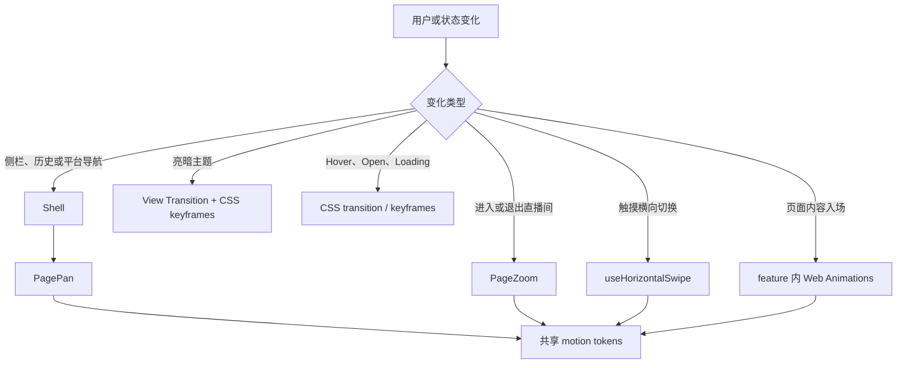

# rLive UI 与动画技术说明

## 1. 文档范围

本文说明 rLive 前端 UI 与动画的现有技术边界、代码归属和扩展规则，适用于 `src/` 下的 React 页面、应用壳、通用组件及交互动效。

设计目标如下：

- 保持 Simple Live 风格的安静、紧凑和工作导向界面，优先保证浏览、筛选、播放和设置效率。
- 动画用于表达导航层级、操作来源和状态变化，不作为持续装饰。
- 桌面与移动端共享业务组件，但允许按输入方式、视口和安全区域调整布局及动画时长。
- 播放、DOM 画面弹幕、滚动和手势同时工作时，动画仍应保持可中断、可清理且不阻塞交互。
- 桌面与移动端的页面与控件统一使用完整动态效果；`src/main.tsx` 在 React 首帧前固定根元素 `data-motion="full"`，不再提供系统 / 完整 / 减少选择项。直播飘屏与录制回放弹幕作为持续运动例外，单独遵循 `prefers-reduced-motion`，右侧弹幕列表不受影响。

代码是最终事实来源。本文列出的数值与行为发生变化时，应同步更新本文。

## 2. 技术栈与职责边界

| 层 | 当前实现 | 职责 |
| --- | --- | --- |
| 视图 | React 19 + React Router | 页面组合、路由状态和组件生命周期 |
| 样式 | Tailwind CSS 4 + `src/styles.css` | 响应式布局、语义颜色、简单状态过渡和全局关键帧 |
| UI 组件 | shadcn-style `base-nova` + Base UI | Button、Tabs、Dialog、Drawer、Field、Select 等可访问基础组件 |
| 图标 | `lucide-react` | 导航、工具按钮和状态图标 |
| 运行时动画 | Web Animations API（`src/shared/motion/tween.ts`） | 页面入场、Zoom、手势回弹及可中断交互反馈；transform/opacity 由合成器推进 |
| 文档快照 | View Transition API + CSS keyframes | 亮暗主题全局淡化 |
| 原生 CSS 动画 | `tw-animate-css` + 自定义 utilities | Overlay 淡入淡出、Drawer 进出、主题淡化、加载旋转和短状态过渡 |
| 直播画面弹幕 | `danmu.js@1.2.1` + CSS transition | DOM 轨道与飘屏；不属于页面 UI 动画层 |
| 录制回放弹幕 | `RecordedDanmakuCanvas` + `requestAnimationFrame` | 按本地媒体时间绘制录制 sidecar，行占位整段预计算，图片表情按分段测量与 `drawImage` 绘制，外观与过滤读取直播弹幕设置 |

当前项目不使用 Framer Motion，也不引入 GSAP 等动画库；全部运行时动效由 Web Animations API 与 CSS 原生承担。不要为一个局部效果引入第二套并行动画体系；先判断现有 `tween()` 助手、CSS、`PagePan`、`PageZoom` 或 View Transition 是否已经覆盖需求。

## 3. UI 系统

### 3.1 代码归属

| 路径 | 责任 |
| --- | --- |
| `src/components/ui/` | shadcn-style 基础组件源码和 variants |
| `src/shared/components/` | 跨功能业务组件，例如刷新按钮、站点切换器和房间卡片 |
| `src/app/layout/` | 标题栏、侧栏、顶部导航、页面滚动容器和路由动效编排 |
| `src/features/*/` | 功能页、功能内组件和局部状态；`features/recording/` 负责桌面录制库与本地回放 |
| `src/shared/motion/` | 跨页面动画令牌、系统减少动效检测、`PagePan` 和 `PageZoom` |
| `src/styles.css` | 主题变量、Tailwind 映射、全局响应式规则和 CSS 关键帧 |
| `src/app/theme.ts` | 主题解析、应用、系统亮暗监听和全局淡化过渡 |

基础组件是仓库内可维护源码，不是不可修改的黑盒。修改 `src/components/ui/` 会影响多个功能页，必须先检查所有调用方；页面特有布局应留在对应 feature 中。

### 3.2 组件选择与组合

新增 UI 时先复用 `src/components/ui/` 中已有组件，再考虑扩展 variant，最后才创建新的基础组件。

- 明确命令使用 `Button`；二元设置使用 `Switch`、`Toggle` 或 `Checkbox`；有限选项使用 `Select` 或 `ToggleGroup`。
- 页面视图切换使用 `Tabs`，`TabsTrigger` 必须放在 `TabsList` 内。
- 表单使用 `Field` 系列；加载、空状态和通知分别使用 `Skeleton`、`Empty`、`Spinner` 和项目 Base UI toast 封装导出的 `notify`。
- 破坏性确认使用 `AlertDialog`；移动端底部面板使用 `Drawer`；短上下文内容使用 `Popover`。
- `Dialog`、`Drawer` 和其他任务型 Overlay 必须有可访问标题，必要时可使用 `sr-only` 隐藏视觉标题。
- Card 只用于独立、重复或需要明确边界的内容，不在 Card 中继续嵌套 Card，也不把整段页面当作悬浮 Card。
- Base UI 通过 `render` 组合自定义 trigger，不使用 Radix 的 `asChild` API。
- 全屏图层内的 Overlay 必须传 `container`，否则默认 portal 到 `<body>` 会被 top layer 压住。播放器把 `player.stageRef` 传给 popover/drawer/tooltip；`notify` 的视口由 `setToastPortalContainer()` 在全屏期间整体移入 stage，退出后还原。

项目配置位于 `components.json`：当前样式为 `base-nova`，primitive 为 Base UI，Tailwind 为 v4，路径别名为 `@/`。

### 3.3 主题与语义令牌

亮暗主题定义在 `src/styles.css`：

- `:root` 提供亮色变量和 `color-scheme: light`。
- `.dark` 覆盖同一组语义变量并设置 `color-scheme: dark`。
- `@theme inline` 将 CSS 变量映射为 Tailwind 的 `bg-background`、`text-foreground`、`bg-card`、`text-muted-foreground` 等 utilities。
- `applyTheme()` 根据 `light`、`dark` 或 `system` 切换根元素 `.dark` class；Zustand 设置变化由 `src/main.tsx` 订阅并立即应用。

新增颜色时应先确定语义，再同时补齐亮暗值和 `@theme inline` 映射。组件中使用语义 token，不写 `bg-white dark:bg-gray-*`，也不使用原始蓝、红、绿值代替状态语义。`RecordedDanmakuCanvas` 等底层绘图无法消费 Tailwind class 时，才使用明确记录用途的中性描边颜色；本机账号实时弹幕沿用平台原色，以底部优先固定而非身份边框区分。

字体栈以 Geist Variable 的 Latin 子集为首选，中文依次回退到系统的 `PingFang SC`、`Microsoft YaHei`、`Noto Sans SC`。紧凑面板和工具区保持小字号、短行高，不使用按视口宽度缩放的字体。

### 3.4 图标、文案与可访问性

- 使用 `lucide-react`，不要手绘已有语义的 SVG。
- Button 内图标使用 `data-icon="inline-start"` 或 `data-icon="inline-end"`；基础组件负责图标尺寸时，不额外添加尺寸 class。
- 纯图标按钮必须提供中文 `aria-label`，不熟悉的工具图标同时提供 Tooltip。
- Tab 键触发的焦点统一由 `src/styles.css` 的全局 `:focus-visible` 规则绘制；新增交互元素仍应优先复用 `focus-ring` 或基础组件的 `focus-visible` 样式。
- 加载与异步结果使用 `role="status"`、`aria-live` 或组件内已有语义；不要仅靠颜色表达状态。
- 界面文案以中文为主，代码标识符、协议名和站点名保留原文。

### 3.5 响应式布局与滚动所有权

`Shell` 是布局与滚动的唯一编排入口：

- 桌面侧栏宽 `68px`，移动端转换为包含安全区域的底部导航；全部可见导航入口在同一 flex 容器内等宽分配，不能为历史、设置等末尾入口保留更窄的固定宽度。
- 移动端交互目标至少为 `44px`；按钮、Toggle、Tabs 等基础组件已为 coarse pointer 提供最小尺寸。
- `env(safe-area-inset-*)` 用于 Android edge-to-edge、底部导航、Drawer 和悬浮按钮，不能用固定 padding 覆盖。
- `main[data-slot="app-content"]` 负责裁剪页面动画产生的横向溢出。
- `div[data-slot="app-page"]` 是普通页面的纵向滚动容器，使用 `overflow-y-auto`、`overscroll-y-contain` 和 `touch-pan-y`。
- feature 页面通常使用 `min-h-full` 或内容自然高度，不应再创建一个会抢占滚轮和触摸手势的全屏滚动层。
- 给祖先增加 `overflow-hidden`、`h-full` 或 transform 前，必须确认没有截断 `app-page` 的滚动范围，也没有改变 fixed/fullscreen 元素的 containing block。

短横屏手机由 `src/styles.css` 中的 coarse-pointer media query 单独压缩标题栏、底部导航和页面 padding。新增 fixed/FAB 控件时，必须同时检查其与底栏、系统安全区域和其他 Overlay 的遮挡关系。

## 4. 动画架构

### 4.1 选择流程



决策原则：

| 需求 | 首选机制 |
| --- | --- |
| Hover、focus、pressed、简单显隐 | Tailwind/CSS transition |
| 一个 React 组件内的运行时入场或反馈 | Web Animations（`src/shared/motion/tween.ts` 的 `tween()`） |
| 多步且需要编排的序列 | 多条并行的 Web Animations 补间 + `Promise.all` 编排 |
| 现有路由整页切换 | `PagePan` 或 `PageZoom`，不要在页面内再叠一层路由动画 |
| 直播间整页进入与退出 | `PageZoom` |
| 跟随手指并可回弹的横向切换 | `useHorizontalSwipe` |
| 整个文档主题快照切换 | `fadeTheme()` |
| 滚动驱动动画 | 当前没有默认方案；只有明确产品需求并证明不会干扰页面滚动时才评估 |

### 4.2 共享 motion tokens

`src/shared/motion/tokens.ts` 输出 Web Animations 与 CSS 共用的动效参数，不依赖任何 JS 动画库。

`src/shared/motion/preference.ts` 不再解析或持久化动效模式。`src/main.tsx` 在 React 首帧前设置根元素 `data-motion="full"`；需要避免非必要动画的调用方通过 `prefersReducedMotion()` 直接读取系统 `prefers-reduced-motion`，不依赖应用设置字段。

| Token/配置 | 当前值 | 用途 |
| --- | --- | --- |
| `EASE_OUT` | `cubic-bezier(0.215, 0.61, 0.355, 1)` | 入场减速曲线，`power2.out`（quad out）的 CSS 等价物，Web Animations 与 CSS 共用 |
| 桌面 enter/exit | `0.22s` | 桌面页面平移和 Zoom |
| 触控 enter/exit | `0.20s` | 移动端更快完成页面读取 |
| `SWIPE_SETTLE_EASING` | 同 `EASE_OUT` | 手势释放收尾；时长不是常量，由手势本身推导 |
| `PAGE_PAN_PERCENT` | `110%` | 横向页面清除 padding 产生的边缘残影 |

手势释放的时长由 `horizontalSwipeSettleDuration(剩余距离, 释放速度)` 得出，钳制在 `170ms ~ 400ms`：收尾是把手指已经开始的运动走完，快速滑动应该更快结束，慢速拖拽则铺开缓出，因此不能是固定值。

不要在 feature 内复制这些数值。确有不同语义时可以局部覆盖，但应通过注释解释原因。

### 4.3 `PagePan`：路由和平台平移

`src/shared/motion/PagePan.tsx` 保留上一个 React subtree，直到离场结束后再卸载。出场页采用 `absolute inset-0` 离开布局流，入场页与出场页保持完全不透明并同步移动，因此表现为一整块连续表面，而不是交叉淡化。

上一页快照只在 `useLayoutEffect` 中更新为 React 已提交的 subtree；路由 key 变化时再由 state 接管这份快照。不要在 render 阶段提前改写快照 ref：React 19 可能放弃或重放并发 render，但 ref 写入不会随之回滚，后续导航会误以为目标页已经显示并漏掉退出层。`PageZoom` 遵循同一约束。

该组件使用 Web Animations API：大列表挂载会占用 React 主线程，Chromium compositor 仍可推进原生 transform 动画。时长与 easing 均读取 `motionProfile()`。

`Shell` 当前映射如下：

- 桌面点击侧栏：按侧栏项目顺序进行纵向平移。
- 移动端点击底部导航：进行横向平移。
- 浏览器/系统前进后退：根据 React Router history index 选择横向方向。
- 首页等平台切换：内层 `PagePan` 进行横向平移；关注页的平台与直播状态是侧栏 Select，不再占用 Shell 顶栏。
- 搜索页：复用 Shell 顶栏的平台页签，不挂载独立页面标题；桌面端在平台页签最左侧显示返回按钮，移动端不挂载显式返回按钮，由 Android 原生返回和系统 / 浏览器历史手势回到上一页。搜索框旁的 Select 负责「全部 / 主播 / 房间号 / 标题」筛选。
- IPTV 源切换：与平台切换共用同一套 `PagePan` 横向平移（分组统一为 group，平台与 IPTV 源走同一路径）。
- 关注页「直播关注 / IPTV 频道」切换：移动端由 `useHorizontalSwipe` 驱动两个保持挂载的面板 track，Shell 顶栏 Tab 与页面手势使用同一 `view`；桌面点击由局部 Web Animations 补间对入场内容执行短距离淡入平移。Shell 保持同一内容容器，避免重挂载丢失前一页签状态。
- IPTV 关注来源与分组切换：关注页桌面左栏顶部与移动端分组条上方的频道源 Select 更新 `source` 查询参数；桌面左侧分组栏与移动端横向分组条更新 `group`，`IptvFollowView` 内层 `PagePan` 保留旧频道列表并按分组顺序平移。
- 不属于上述来源的普通内容更新：直接替换，不自动添加整页动画。

直接侧栏导航时，`RouteOutlet` 延迟一个 `requestAnimationFrame` 再以 `startTransition()` 挂载目标 route，使 compositor 先启动平移，避免大列表首帧卡住。

动画完成后先用 `commitStyles()` 固定旧页的离屏最终位置，再同步卸载旧 subtree；不能先取消 Animation、再把卸载放进低优先级更新，否则 Android 合成器可能短暂恢复旧页原位。

### 4.4 `PageZoom`：直播间进入与退出

`src/shared/motion/PageZoom.tsx` 专门处理直播间路由：

进出共用 `motionProfile().roomZoom` 的同一个时长（桌面 `0.26s`，触摸 `0.22s`），而不是各自取 `enter` / `exit`。进入直播间和离开直播间是同一段动效的正反两个方向，两端时长不同会让一次往返显得头重脚轻。它比整页平移略长，因为这里是两个全屏表面互相溶解，且直播间还要在后面把播放器顶起来。

- 进入：`scale: ROOM_ZOOM_START_SCALE (0.96) -> 1`，同时 `opacity: 0 -> 1`。此时浏览列表已立即卸载，直播间是屏幕上唯一的表面。
- 退出：改为双层交叉溶解，两层各自一条 Web Animations 补间、从时间 `0` 同时开始：
  - 离场的直播间 subtree 保持挂载，执行 `scale: 1 -> 0.96` 与 `opacity: 1 -> 0`，是进入动画的逆向播放；
  - 目标页从 `scale: ROOM_ZOOM_BACKDROP_SCALE (1.02) -> 1` 与 `opacity: 0 -> 1` 展开。这个反向缩放刻意比 `0.96` 更贴近 `1`：目标页是背景而非主体，给它同样的位移会让两层看起来走了一样的距离，反而压平了 zoom 想表达的纵深。
  - 离场补间只跑 `duration * ROOM_ZOOM_EXIT_RATIO (0.72)`，让两层有重叠，避免视口中间穿过一帧全空画面。
- 退出期间入场节点带 `bg-background`：它是从透明淡入的，没有自己的底色时，离场直播间会在整段交叉溶解里透过目标页继续可见。
- 出场节点 `pointer-events: none`，避免旧页面在过渡期接收输入；退出期间入场节点同样不接收输入。
- 入场完成后清除 transform、opacity、visibility、transform origin 和 `will-change`，保证全屏播放器没有永久 transformed ancestor；退出节点在最终帧后直接卸载，不先恢复这些属性。

离场直播间在两条补间都完成（较长的入场补间结束）后才卸载，而不是在它自己那条更短的补间结束时卸载。React 在过渡中途移除一个活跃播放器，会在仍在动的那层背景上表现为一次可见的顿挫。

不要在补间完成回调中先恢复出场节点的 opacity 再卸载，这会导致最后一帧闪出直播内容。退出 subtree 只在最终帧之后删除。

Zoom 覆盖全部沉浸式播放页：`/room/*` 和 IPTV 的 `/iptv/play`。两者共用同一套进出动画，但 `zoomKey` 取各自的 pathname，因此直播间与 IPTV 播放页之间切换不会被当成同一个页面而跳过过渡。不要让两者共用一个固定 key。

沉浸式播放页只有 Zoom 一层路由动画。`Shell` 中沉浸式分支渲染裸容器，路由级 `PagePan` 只作用于非沉浸式分支，二者互斥，不会叠加。

房间 A 通过右侧关注栏切换到房间 B 时使用 replace，避免历史栈在房间之间来回跳转；B 的返回目标固定为 `/follow`，退出仍由同一个 `PageZoom` 处理。

### 4.5 `useHorizontalSwipe`：触摸手势

`src/shared/hooks/useHorizontalSwipe.ts` 用 capture-phase pointer handlers 处理 Android WebView 中的横向切换，并保留原生纵向滚动：

- surface 使用 `touch-pan-y`；纵向手势仍交给浏览器滚动。
- 移动距离达到 `10px` 后才锁定方向，横向距离需大于纵向的 `1.25` 倍。
- 跟手阶段直接在 pointermove 中写 `transform`，不再合并到 `requestAnimationFrame`。合并会让每一帧都绘制上一帧的手指位置，这恰好就是「不跟手」的观感。
- 到达首尾边界时只保留 `0.18` 倍位移，表达不可继续而不是循环。
- 是否翻页由手势进度与释放速度共同决定，不再使用固定的 `48px` 绝对距离：
  - 与拖动同向的快速滑动（`≥0.32 px/ms`）在任意距离都翻页，短距离轻扫可用；
  - 反向回拉在任意距离都取消，避免拖过半屏后又拉回却仍然翻页；
  - 其余情况按位置判定，页面实际走过的屏占比需达到 `HORIZONTAL_SWIPE_COMMIT_PROGRESS`（`0.42`）。
  - 释放速度取最近 `32ms` 窗口内样本的平均值。单纯对最后两个事件求差分噪声过大，会把稳定拖动误判为快扫；窗口自最新样本向前取，因此松手前停顿的手指速度读数为 `0`，回到位置判定。
- 释放后由 Web Animations 接管剩余位移，时长按 `horizontalSwipeSettleDuration` 从剩余距离和释放速度推导。这里必须用 Web Animations 而不是 JS 补间：翻页会触发 React 提交，rAF ticker 与该提交争抢主线程，重路由下会吞掉收尾动画的大部分帧——这正是「先切页再平移」的直接原因。Web Animations 的 transform 由 Chromium 合成器推进，不受主线程占用影响。
- 手势中途抓住正在收尾的页面时，从其当前实际像素位置接管（`DOMMatrixReadOnly` 读取），不回跳。
- `layout` 只保留两种承载方式：
  - `track`：所有挂载页按**绝对索引**排布在 `index × width`，整层平移到 `-活动索引 × width`。提交时没有任何页需要位移，释放时启动的收尾动画可以一路走完。用于 Shell 移动端平台切换、关注页双 Tab、历史页双 Tab 和房间侧栏 Tab。
  - `page`：移动层只承载当前一页，供相邻页未挂载的条带使用。提交时先按 `horizontalSwipeCommitOffset` 把新页重基到一屏外，再滑入 `0`。
  - 原 `panels` 布局已移除：它让各页按 `(索引 - 活动索引) × 100%` 定位，于是提交瞬间所有面板整体重锚一屏，收尾动画不得不围绕这次跳变重基。多出的这一步就是关注页卡顿最明显的来源。改为绝对索引后，各页仍保留独立滚动容器。
- 收尾动画在通知 React 之前启动，顺序不能颠倒：`track` 的提交不移动任何页，先行启动可以避免整个 React 提交挤在松手与首个动画帧之间。
- `track` 的宽度测量取移动层所在 viewport（父元素 `clientWidth`），因此点击 Tab 触发的切换在首次交互即可动画，无需等待一次指针按下来校准宽度。
- 提交后的兜底回滚使用 `600ms` 超时而不是单帧检查。`BrowserRouter` 把每次 location 更新包在 `startTransition` 中，受控值可能延后若干帧才到达；单帧检查会在正常的延后提交上误判为「调用方拒绝」并把页面拉回原位。该超时需要长于收尾动画上限（`400ms`），否则会打断正常提交。
- 移动端相邻平台页为无缝预览保持挂载，但使用 layout/paint/style containment 隔离；完全离屏页的 CSS animation 暂停，成为活动页后自动恢复。
- Slider、Input、Textarea、Select、可编辑区域和 ScrollArea scrollbar 拥有自己的连续手势，不被页面 swipe 接管。
- 已识别 swipe 后短暂抑制合成 click，避免 Android WebView 误触当前控件。

该 hook 全程使用原生 API。开始新手势、禁用 hook 或组件卸载时，必须取消在飞的 Animation、清掉兜底回滚定时器并清除 transform/`will-change`；取消收尾动画时要先把它当前到达的像素位置写回 inline style，否则会回跳到动画起点。

### 4.6 `useLongPress`：触摸长按

`src/shared/hooks/useLongPress.ts` 把「按住不动约半秒」翻译为一次回调；`useLongPressDrawer` 在其上封装抽屉开关、Android Back 收起与点按抑制，由 `RoomCard` 与关注页的直播/频道卡片共用，移动端长按即弹出底部操作抽屉。Back 收起依赖 `AndroidBackNavigator` 派发的 `rlive:android-back` 事件，它在包括底部导航根页在内的所有路由上生效（返回链与根路由退桌面语义见 `docs/zh/架构说明.md` 第 6 节）。判定常量在 `src/shared/gestures/longPress.ts`：

- 只有触摸/触控笔主指针参与；鼠标交给右键菜单，桌面端直接 `enabled: false`。
- 按下后 `500ms` 触发；漂移超过 `10px` 半径、抬起或 pointercancel（滚动接管）都会终止，因此长按与列表滚动、页签横滑互不冲突。
- Android WebView 在系统长按点会派发原生 `contextmenu`：调用方在卡片上 `preventDefault` 并经 `triggerNow()` 立即触发，既拦下 WebView 自带菜单，也让触发时机与系统长按一致；自持计时器承担 iOS WebView（不保证派发 contextmenu）与兜底。`contextmenu` 必须归属本卡片的按压才会触发：系统长按只认手势，若手指实际按在退出中的抽屉遮罩上（快速长按-收起循环的典型竞态），WebView 会把 `contextmenu` 重定向到下层卡片，这种伪信号距上次触发不小于一个触发周期，超出 `LONG_PRESS_CONTEXTMENU_GRACE_MS`（300ms）宽限后一律忽略，否则用户刚收起的抽屉会被立即弹回。
- 触发后松手可能合成一次 click，调用方需用「触发时置位、下次 pointerdown 清零」的标记抑制，避免长按弹抽屉后误入房间。
- 卡片封面/缩略图在 `@media (pointer: coarse)` 下 `pointer-events: none`（`.room-card img`、`[data-motion-press] img`）：Android WebView 149+ 在 `` 上识别长按会启动原生图片菜单接管（pointercancel 先于 contextmenu 到达），应用层 `preventDefault` 取消菜单后 WebView 触摸路由悬死——后续 touch 全部不再派发到页面，表现为只能滚动、点按与 Tab 全部失效（真机 vivo x300 实测）。让图片不参与命中测试后长按落在容器上，接管与菜单都不会发生，pointercancel 也不再出现。
- 抽屉退出动画期间（`data-closed` 存在时）遮罩与弹层 `pointer-events: none`（`styles.css` 中 `.motion-dialog-overlay` 等规则）：快速再按时触摸穿透到下层页面，避免抬手事件派发到已卸载的遮罩节点上被吞，那会使 WebView 手势状态残留、后续点按不再合成 click（表现为只能滚动和长按，点击无响应）。
- 关注卡片上长按计时与 dnd-kit 拖拽激活器组合在同一次 pointerdown；触摸不会激活 MouseSensor，长按与桌面鼠标拖拽互不干扰。
- iOS 侧长按封面图的系统存储菜单由全局 `@media (pointer: coarse)` 规则中的 `-webkit-touch-callout: none` 压制（`styles.css`）。

### 4.7 feature 页面入场

IPTV 与设置页不创建局部补间，页面动效全部由 `PagePan` 承担，不改变 Shell 的滚动和路由层：

- 设置页不显示 Shell 或内容级顶部 header。桌面端与移动端共用「设置首页 → 分类详情」二级结构：首页按观看体验、账号与数据、应用信息分组，详情分类写入 `section` 查询参数，使系统返回、浏览器返回和页内返回保持一致。
- 一级与二级页面复用 `PagePan` 保留退出视图：进入分类时一级向左退出、二级从右进入，返回时方向反转。动画覆盖页内返回、浏览器历史和 Android 边缘返回。
- 每个设置层级在 `PagePan` 内容层内独立纵向滚动。这样从较深位置返回时，退出的详情保持原滚动位置，进入的首页从顶部出现，外层 `app-page` 不会继承错误的 `scrollTop` 或产生双滚动条。
- 搜索框仅在首页筛选分类；详情页头只保留返回按钮和当前分类标题。返回按钮必须留在横向裁剪边界内，不使用负边距把 Hover 背景移出 `PagePan` 内容层。首次深链进入设置页时不挂载相邻设置分类，页面直接呈现。
- 设置页的过渡与样式归还由 `PagePan` 统一承担（`commitStyles` 固定离场位置后同步卸载），页面自身不创建补间。
- IPTV 之前对首批 18 张频道卡片的 stagger 入场已移除，频道网格与其他卡片页面（首页、分类、搜索、关注）保持一致，路由导航层面的位移由 `PagePan` 统一承担。
- 频道卡片复用 `.room-card`，共享其 `content-visibility: auto` 长列表优化和移动端按压 `max-md:active:scale-[0.97]` 反馈。
- 录制库 `RecordingsPage` 一级页不自带页面标题：应用顶栏左侧是「全部 / 录制中 / 已录制」范围 Tab（`role="tablist"`，与 `/history` 的时间线切换器同款下划线指示器和数量后缀），右侧是「保存位置」按钮；侧栏「录制」入口在有活动任务时叠加 destructive 计数 `Badge`。页面主体使用与关注页一致的左侧用户栏和右侧录播 Card 网格；平台筛选复用 `PlatformFilterSelect`，右侧 Card 图标使用录制时保存的直播间封面，左侧用户图标使用独立保存的主播头像。一级页不挂载播放器，也不请求媒体 URL。点击已保存 Card 进入 `/recordings/play/:recordingId` 二级播放页；二级页对齐直播间沉浸式布局，使用居中标题顶栏、无圆角左侧播放器和 `300–320px` 右侧录制信息栏，窄窗口上下堆叠。标题栏右侧的 `RecordingControl` 与「定时关闭」并列，开始时用玻璃 `Popover + FieldGroup + Switch` 选择是否写入弹幕 sidecar，以及是否允许无提示离页继续。弹幕初始值来自桌面设置页，离页继续固定为开启，两项都仍可按任务覆盖；`RecordingLeaveGuard` 在录制中使用 `AlertDialog` 提供留在页面、继续录制并离开、停止录制并离开三种明确动作，`RecordingExitGuard` 在关闭应用且仍有活动任务时用同款 `AlertDialog` 提供「继续录制」与「结束录制并退出」。录制中的圆点与时间码是唯一持续状态提示。停止、删除、目录切换和文件定位使用现有 `Button` / `AlertDialog` / `Dialog` / `Empty` / `Skeleton` 组合，不新增平行基础组件。`RecordingPlayer` 使用 xgplayer 协议插件并复用直播间的 `PlayerControls`、悬浮控制层和全屏身份栏；播放器进度轴使用细轨道、已缓冲层、已播放层和悬停把手，当前/总时长合并在右侧，倍速与弹幕回放设置作为共享控制条的录制扩展内容，设置菜单不再添加重复的「回放」分组标题。`RecordedDanmakuCanvas` 只在回放阶段按媒体时间绘制可开关弹幕，并从全局设置读取显示与过滤参数；减少动态效果时停止横向飘移。页面只在桌面客户端提供完整内容，移动端以明确的 Empty 状态说明能力边界。

长列表不得为所有项目同时创建 tween。优先只动画首屏或有界数量；无限滚动追加内容默认直接出现，避免动画持续争用播放器和画面弹幕的主线程预算。

### 4.8 主题全局淡化

主题切换由 `src/app/theme.ts`、`src/app/layout/Sidebar.tsx` 与设置页「外观配置」协作；亮暗模式提供跟随系统（默认）、浅色、深色三档，移动端同样可用，跟随系统时由 `watchSystemThemeChanges()` 监听系统亮暗变化并实时重应用：

1. `document.startViewTransition()` 分别捕获旧主题和新主题快照。
2. `flushSync()` 在 update callback 中应用 Zustand 主题，确保新快照包含更新后的 React 图标与 `.dark` class。
3. CSS `theme-fade` keyframe 对 `::view-transition-new(root)` 做 `opacity` 0→1 的整屏淡入，旧快照静态垫底；指针点击与键盘激活共用同一条时间线。
4. desktop 动画为 `280ms`，coarse pointer 为 `240ms`；侧栏按钮在过渡开始时另有 scale/rotation 反馈。
5. `src/styles.css` 同时关闭浏览器默认的 root-group `250ms` 插值和 snapshot crossfade，整个切换只保留一条淡化时间线。
6. `ViewTransition.finished` 直接作为唯一结束信号，完成后清理 `data-theme-fade`、临时 CSS 变量和补间行内样式。

不支持 View Transition API 时直接切换主题。快速连续点击由组件锁和可取消 transition 共同约束，不能留下临时 CSS 变量或未结束的快照状态。

### 4.9 CSS 动画

CSS 只承担无需 JavaScript 编排的短状态：

- `transition-*`：hover、focus、pressed、Tabs indicator 和播放器控制条显隐。
- `animate-spin-soft`：加载图标的连续旋转。
- Base UI 状态 transition：Popover、Tooltip、Dialog、AlertDialog、Drawer 和 Toast 使用 `data-starting-style` / `data-ending-style`，快速反向操作可从当前帧继续。
- Tooltip 首次 Hover 延迟 `350ms`，相邻 Tooltip 使用 Base UI 的即时状态并跳过动画。
- Drawer 进入 `240ms`、退出 `160ms`；Dialog 进入 `200ms`、退出 `140ms`；Popover 进入 `160ms`、退出 `110ms`。

CSS 交互动画优先使用可中断 transition；只在主题淡化、加载旋转等确定时间线使用 keyframes。新增效果继续只动画 `transform` / `opacity`，并复用 `--motion-ease-out` 或 `--motion-ease-drawer`。

## 5. React + Web Animations 实现规范

### 5.1 组件内动画模板

```tsx
import { useLayoutEffect, useRef } from "react";
import { motionProfile } from "@/shared/motion/tokens";
import { settleTween, tween } from "@/shared/motion/tween";

const rootRef = useRef<HTMLDivElement>(null);

useLayoutEffect(
  () => {
    const target = rootRef.current?.querySelector<HTMLElement>("[data-motion-target]");
    if (!target) return;

    const profile = motionProfile();
    target.style.willChange = "transform,opacity";
    settleTween(
      target,
      tween(
        target,
        [
          { opacity: 0, transform: "translate3d(0, 8px, 0)" },
          { opacity: 1, transform: "translate3d(0, 0, 0)" },
        ],
        {
          duration: profile.enter.duration * 1000,
          easing: profile.enter.ease,
          fill: "both",
        },
      ),
    );
  },
  [contentKey],
);
```

规则：

- 使用真实 DOM ref；字符串 selector 必须限定在 scope 容器内。
- `tween()` 会先取消同元素上仍在运行的旧补间；结束帧与自然态一致的补间用 `settleTween` 收尾，它会在完成后撤销动画并归还行内样式。
- 结束态需要保留的表面（如提示层展开后的 opacity）不要 settle，让 fill 持有终态，由下一次反向补间接替。
- 只在浏览器 lifecycle（effect、事件回调）内创建动画，不在 render 阶段调用。

### 5.2 事件回调中的补间

点击、Promise 或定时器等在 effect 执行后才创建动画的回调，直接使用 `tween()` / `killTweensOf()`；它们不依赖组件生命周期，元素随子树卸载后条目被 WeakMap 一并回收：

```tsx
const buttonRef = useRef<HTMLButtonElement>(null);

const animatePress = () => {
  const button = buttonRef.current;
  if (!button) return;
  button.style.willChange = "transform";
  settleTween(
    button,
    tween(
      button,
      [{ transform: "scale(0.94)" }, { transform: "scale(1)" }],
      { duration: 180, easing: EASE_OUT, fill: "both" },
    ),
  );
};
```

原生 event listener、`requestAnimationFrame`、长时间存活的 Animation 和 pointer capture 仍需要各自显式清理；快速重复触发由 `tween()` 的自动取消约束。

### 5.3 Exit 动画生命周期

React 会在节点离开 element tree 时立即卸载它，不能对已经卸载的 DOM 做 exit animation。需要退出动画的共享容器应遵循：

1. 在 layout effect 中记录最后一次已提交的 subtree，并由 state 保存需要退出的快照；不要在 render 阶段推进快照 ref。
2. 新旧 subtree 同时渲染，旧节点脱离布局流并禁用输入。
3. 执行 exit；取消或路由再次变化时终止旧动画。
4. 等最终帧完成后固定退出样式并同步卸载旧 subtree；完成回调必须校验快照身份，不能清除后续导航创建的新退出层。
5. 清理 animation、RAF、inline style 和 `will-change`。

已有场景应复用 `PagePan` 或 `PageZoom`，不要在 feature 中复制这套持有逻辑。

## 6. 性能规则

- 位移、缩放和旋转统一走 CSS transform（经 Web Animations 或 CSS transition）；显隐只动画 opacity。
- 避免通过动画修改 `width`、`height`、`top`、`left`、margin、padding 和其他触发布局的属性。
- 先完成 DOM 读取，再批量写入；不要在一个 pointermove 中交替读取布局和写 style。
- `will-change` 只在动画实际运行时设置，结束、取消和卸载都必须清除。长期 layer promotion 会增加显存和合成成本。
- 同一 target 开始新补间前先经 `tween()` 自动取消旧补间（或手动 `killTweensOf()`），避免手势、导航或快速点击产生叠加动画。
- 相同列表效果使用一条编排好的序列，不要为每项创建独立 delay；动画目标数量必须有界。
- 大型直播列表继续使用 `.room-card` 的 `content-visibility: auto`，不要用入场动画强制所有离屏卡片参与绘制。
- 播放器、danmu.js DOM 弹幕和页面动画共享主线程与合成预算。播放页面避免模糊、滤镜、大面积阴影变化和无限背景动画。
- Android 宿主进入前台时请求同分辨率下不高于 120 Hz 的最高高刷模式；60/90 Hz 设备使用自身可用上限，只有 60/144 Hz 的面板回退到 144 Hz，系统省电、温控与动态刷新策略仍可覆盖该偏好。WebView 的 `requestAnimationFrame` 继续跟随系统实际刷新率，不设置固定帧率 ticker。
- 实时飘屏的位置与时序由 danmu.js 的单条 linear transform transition 管理，不再维护应用级逐帧渲染循环、目标 FPS、跳帧或位图缓存。普通消息使用 `moveV: 100` 和 `setPlayRate` 实现可配置的 `50–200 px/s` 匀速移动，SC 只使用平台提供的持续时长；不要为调整飘屏快慢叠加 JS 补间。
- `DanmuJsDanmaku` 在播放器内叠放两个全尺寸兄弟容器，并分别创建 `scroll` / `top` danmu.js 实例；必须等两个容器有非零尺寸后才启动，零尺寸期间只保留有界、带过期时间的 pending。`active`、`sessionKey`、页面可见性、减少动态效果偏好或组件卸载变化时销毁两个旧实例和 listener，避免隐藏播放器继续分配 DOM。
- danmu.js 数据池、本地 metadata、聚合目标和 SC 计时器都必须有界，并在 `bullet_remove` / `destroy` 时同步释放。活跃 bullet 预算按当前轨道数推算（`120–800`），高弹幕量下丢弃新到消息而不是移除正在滚动的弹幕；danmu.js 在轨道占满时静默丢弃的 comment 由「送出超过 1 秒仍未 attach」的回收扫描释放。普通聊天聚合只更新同一活动 bullet 的文本与计数槽，不为每次 `×N` 变化重新创建动画。
- B 站图片表情使用预设尺寸的安全 DOM 节点，加载失败回退原文，避免图片就绪后改变轨道高度或让弹幕跳动。平台文本不得写入 `innerHTML`。
- 两个弹幕容器都保持 `opacity: 1`；普通消息与 SC 从统一的 `danmaku_opacity` 读取值并写到各自元素，避免容器与子项透明度相乘。用户显示区域只控制 `scroll` 实例的普通滚动弹幕，使用 danmu.js 原生 `area.start = 0`、`area.end = danmaku_area`；承载 SC 和自己发送弹幕的 `top` 实例固定为 `area: { start: 0, end: 1 }`，使固定弹幕从播放器顶部开始排布。窗口 resize、最大化或全屏后，两个实例应由各自的 ResizeObserver 分别重排；字号和可选描边变化更新两层的现有 DOM 与后续 comment，描边为 0 时必须移除 `-webkit-text-stroke` 与 `paint-order`，字重固定为 B 站直播默认粗体 `700`，区域变化只更新 `scroll` 层。
- 连续手势输入不进 React state，React state 只承担刷新、选中项等离散状态，不保存每个输入事件的位移。下拉刷新的位移通过 RAF 合并；横向滑动的位移直接在 pointermove 中写 transform，因为跟手位置延后一帧即可被察觉。
- 移动端推荐、分类、分区、关注、历史、IPTV 及房间内关注列表统一使用下拉刷新，不渲染显式刷新浮动按钮；桌面端仍保留按钮入口。
- 浏览器回退亮度使用覆盖视频与实时弹幕 DOM 容器的黑色 opacity 叠层，不对整幅动态画面应用 `filter: brightness()`；Android Tauri 则只覆盖当前 Activity 的窗口亮度，并在房间切换、离开或后台时恢复。手势提示通过局部 DOM 写入更新，避免每个步进重渲染 `PlayerPane`。
- 播放器控制栏使用 `player-scrim-overlay`：由底边向画面上方淡出的黑色渐变，参考常规播放器，不设上边框也不使用 `backdrop-filter`。渐变画在 `::before` 上并高于控制栏自身高度，让淡出在第一个控件之前完成，避免出现可见的条带边界；控制栏材质贴合播放器左右和底边，自动显隐仅合成 opacity，不触发播放器 React 重渲染。
- 音量和播放设置 Drawer / 弹层仍使用 `glass-surface-overlay`：桌面 `14px` blur；coarse pointer 或 slow-update 设备关闭 `backdrop-filter`，改用更实的静态半透明底色。移动端对话框遮罩、视频浮层和房间卡片角标同样不采样动态背景，避免滚动、视频解码与 DOM 弹幕争抢 GPU 合成预算。
- 移动端紧凑播放器控制栏使用 `32px` 按钮和输入组，底部内边距压缩到 `1px + safe-area`，顶部保留渐变淡出所需的少量留白；这是仅限视频边缘常用媒体操作的触控尺寸例外，应用导航和表单仍遵守 `44px` 目标。
- 动画 wrapper 不得扩大滚动区域；外层负责 clipping，实际纵向滚动留给 `app-page`。
- fullscreen 播放器稳定后不能保留 transformed ancestor；Zoom 和页面动画完成时必须恢复普通绘制。

## 7. 完整动态效果

应用不暴露动态效果选择项，桌面与 Android 使用同一套页面转场、Overlay、按压、Hover 和手势收尾；系统要求减少动态效果时，各动画调用方跳过或缩短非必要动画。

完整动态效果不等于增加持续装饰：高频键盘操作保持即时，列表轮询和弹幕新增直接更新；Hover、按压和 Overlay 保持短促可中断，页面动画只表达导航层级。焦点、滚动位置、选中状态和可点击区域仍须独立于动画正确工作。

## 8. 新增 UI 或动画的流程

1. 确定 owner：基础组件、shared component、Shell 还是具体 feature。
2. 检查 `src/components/ui/` 与现有 motion 封装，避免平行实现。
3. 先完成无动画的布局、滚动、焦点、键盘和触控行为。
4. 按第 4.1 节选择 CSS、Web Animations、`PagePan`、`PageZoom` 或 View Transition。
5. 使用共享 token，并实现取消、卸载和 inline style 清理。
6. 检查桌面、手机竖屏、短横屏、安全区域、长中文和最大数据量。
7. 执行聚焦检查与浏览器验证；改动完成后再同步到 Windows 镜像。

不要把“组件出现”默认等同于“需要动画”。高频列表刷新、轮询状态、弹幕新增和播放器帧更新通常应直接更新，避免视觉噪声和持续合成开销。

## 9. 验证清单

### 9.1 静态检查

```bash
bun run check
bun test tests/
bun run build
```

纯文档修改不要求运行时测试；UI 或动画实现应根据风险至少执行 `bun run check` 和对应单元测试，交付前运行生产构建。

### 9.2 浏览器检查

建议至少覆盖：

- 桌面 `1280x720` 或更大视口。
- 手机竖屏约 `360x732`。
- coarse pointer 的短横屏约 `844x390`。
- 操作系统开启 `prefers-reduced-motion: reduce` 时，页面导航仍沿用应用的完整动效策略；直播画面飘屏按既有策略停用，录制回放弹幕停止横向飘移并按媒体时间短暂静态显示。偏好恢复后直播弹幕建立全新会话，不补放旧消息。

每个动画检查开始帧、中间帧、最终帧和快速重复操作：

- 页面没有空白、闪回、旧 subtree 短暂复活或边缘残影。
- 动画过程中无双滚动条，结束后仍可完整纵向滚动。
- fixed、FAB、底部导航、Drawer 和播放器控制不互相遮挡。
- 触摸 swipe 不抢占纵向滚动、Slider、Input 和 ScrollArea scrollbar。
- 最终 DOM 不残留 transform、opacity、visibility、`will-change`、临时 data attribute 或 finished Animation。
- Console 无新增 error/warning，动画运行时无明显 layout shift。
- Home Card、关注 Card、深链接和“关注栏切房后返回 `/follow`”均使用 `PageZoom`，导航目标正确。
- 退出动画结束后旧直播 subtree 直接卸载，不恢复 opacity，避免直播内容末帧闪烁。

主题和播放器叠层类视觉效果不能只检查 DOM 存在；应结合截图或像素检查确认实际画面非空且方向正确。

### 9.3 WSL 到 Windows

所有源码修改与验证都在 WSL 的 `/home/shenss/python/rLive` 完成。交付前同步镜像：

```bash
cp scripts/windows-sync.conf.example scripts/windows-sync.conf
# 编辑 scripts/windows-sync.conf，设置 WINDOWS_SYNC_PATH
bash scripts/sync-to-windows.sh
```

同步目标由 `scripts/windows-sync.conf` 的 `WINDOWS_SYNC_PATH` 配置，不再固定为某个盘符。同步不会触发 Windows/Tauri build；只有明确需要 Windows 运行验证或发布时才执行对应构建流程。

## 10. 关键源码索引

| 文件 | 内容 |
| --- | --- |
| `components.json` | shadcn-style 项目配置、Base UI 和路径别名 |
| `src/styles.css` | 主题 tokens、全局响应式规则、View Transition 和 CSS 动画 |
| `src/components/ui/button.tsx` | 按钮 variants、焦点和 coarse-pointer 尺寸 |
| `src/components/ui/drawer.tsx` | Drawer 结构、方向和开关动画 |
| `src/app/layout/Shell.tsx` | 页面滚动、路由来源识别和动画编排 |
| `src/app/layout/Sidebar.tsx` | 桌面/移动导航和主题按钮反馈 |
| `src/app/theme.ts` | 主题应用、系统亮暗监听与全局淡化过渡 |
| `src/shared/motion/preference.ts` | 系统减少动效偏好检测 |
| `src/shared/motion/tokens.ts` | 共享 easing 和 duration |
| `src/shared/motion/tween.ts` | Web Animations 补间助手：取消旧补间与行内样式归还 |
| `src/shared/motion/PagePan.tsx` | 整页平移与 outgoing subtree 生命周期 |
| `src/shared/motion/PageZoom.tsx` | 直播间 Zoom 进入和退出 |
| `src/shared/hooks/useHorizontalSwipe.ts` | 触摸跟随、回弹、切换和清理 |
| `src/shared/gestures/horizontalSwipe.ts` | swipe 阈值、边界阻尼和纯逻辑 |
| `src/features/iptv/IptvPage.tsx` | 有界频道卡片入场 |
| `src/features/settings/SettingsPage.tsx` | 双端二级设置中心、分组入口、分类详情、设置搜索和页面入场 |
