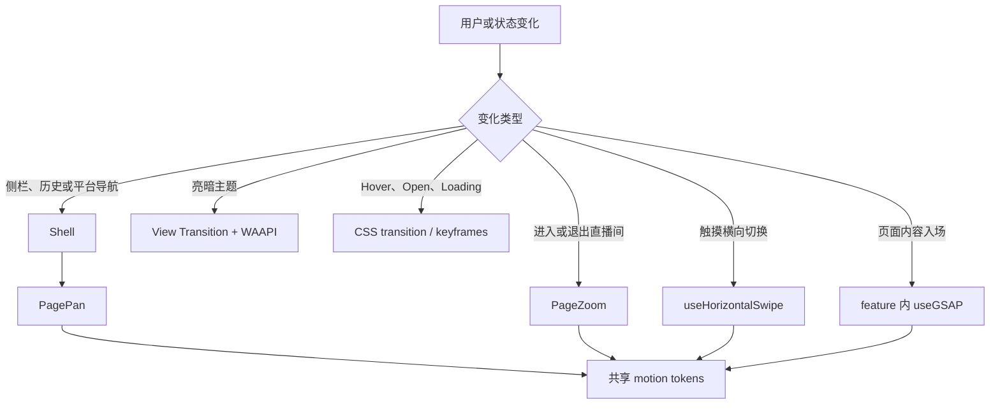

# rLive UI 与动画技术说明

## 1. 文档范围

本文说明 rLive 前端 UI 与动画的现有技术边界、代码归属和扩展规则，适用于 `src/` 下的 React 页面、应用壳、通用组件及交互动效。

设计目标如下：

- 保持 Simple Live 风格的安静、紧凑和工作导向界面，优先保证浏览、筛选、播放和设置效率。
- 动画用于表达导航层级、操作来源和状态变化，不作为持续装饰。
- 桌面与移动端共享业务组件，但允许按输入方式、视口和安全区域调整布局及动画时长。
- 播放、Canvas 弹幕、滚动和手势同时工作时，动画仍应保持可中断、可清理且不阻塞交互。
- 所有新增动态效果都必须提供 `prefers-reduced-motion` 回退。

代码是最终事实来源。本文列出的数值与行为发生变化时，应同步更新本文。

## 2. 技术栈与职责边界

| 层 | 当前实现 | 职责 |
| --- | --- | --- |
| 视图 | React 19 + React Router | 页面组合、路由状态和组件生命周期 |
| 样式 | Tailwind CSS 4 + `src/styles.css` | 响应式布局、语义颜色、简单状态过渡和全局关键帧 |
| UI 组件 | shadcn-style `base-nova` + Base UI | Button、Tabs、Dialog、Drawer、Field、Select 等可访问基础组件 |
| 图标 | `lucide-react` | 导航、工具按钮和状态图标 |
| 运行时动画 | GSAP + `@gsap/react` | 页面入场、Zoom、手势回弹及可中断交互反馈 |
| 浏览器动画 | Web Animations API | 路由整页平移和 View Transition 伪元素动画 |
| 文档快照 | View Transition API | 亮暗主题 Radial Reveal |
| 原生 CSS 动画 | `tw-animate-css` + 自定义 utilities | Overlay 淡入淡出、Drawer 进出、加载旋转和短状态过渡 |
| Canvas 帧循环 | `requestAnimationFrame` | 弹幕绘制；不属于页面 UI 动画层 |

当前项目不使用 Framer Motion，也没有启用 ScrollTrigger。不要为一个局部效果引入第二套并行动画体系；先判断现有 GSAP、CSS、`PagePan`、`PageZoom` 或 View Transition 是否已经覆盖需求。

## 3. UI 系统

### 3.1 代码归属

| 路径 | 责任 |
| --- | --- |
| `src/components/ui/` | shadcn-style 基础组件源码和 variants |
| `src/shared/components/` | 跨功能业务组件，例如刷新按钮、站点切换器和房间卡片 |
| `src/app/layout/` | 标题栏、侧栏、顶部导航、页面滚动容器和路由动效编排 |
| `src/features/*/` | 功能页、功能内组件和局部状态 |
| `src/shared/motion/` | 跨页面动画令牌、`PagePan` 和 `PageZoom` |
| `src/styles.css` | 主题变量、Tailwind 映射、全局响应式规则和 CSS 关键帧 |
| `src/app/theme.ts` | 主题解析、应用和 Radial Reveal |

基础组件是仓库内可维护源码，不是不可修改的黑盒。修改 `src/components/ui/` 会影响多个功能页，必须先检查所有调用方；页面特有布局应留在对应 feature 中。

### 3.2 组件选择与组合

新增 UI 时先复用 `src/components/ui/` 中已有组件，再考虑扩展 variant，最后才创建新的基础组件。

- 明确命令使用 `Button`；二元设置使用 `Switch`、`Toggle` 或 `Checkbox`；有限选项使用 `Select` 或 `ToggleGroup`。
- 页面视图切换使用 `Tabs`，`TabsTrigger` 必须放在 `TabsList` 内。
- 表单使用 `Field` 系列；加载、空状态和通知分别使用 `Skeleton`、`Empty`、`Spinner` 和项目 Base UI toast 封装导出的 `notify`。
- 破坏性确认使用 `AlertDialog`；移动端底部面板使用 `Drawer`；短上下文内容使用 `Popover`。
- `Dialog`、`Drawer` 和其他任务型 Overlay 必须有可访问标题，必要时可使用 `sr-only` 隐藏视觉标题。
- Card 只用于独立、重复或需要明确边界的内容，不在 Card 中继续嵌套 Card，也不把整段页面当作悬浮 Card。
- Base UI 通过 `render` 组合自定义 trigger，不使用 Radix 的 `asChild` API。

项目配置位于 `components.json`：当前样式为 `base-nova`，primitive 为 Base UI，Tailwind 为 v4，路径别名为 `@/`。

### 3.3 主题与语义令牌

亮暗主题定义在 `src/styles.css`：

- `:root` 提供亮色变量和 `color-scheme: light`。
- `.dark` 覆盖同一组语义变量并设置 `color-scheme: dark`。
- `@theme inline` 将 CSS 变量映射为 Tailwind 的 `bg-background`、`text-foreground`、`bg-card`、`text-muted-foreground` 等 utilities。
- `applyTheme()` 根据 `light`、`dark` 或 `system` 切换根元素 `.dark` class；Zustand 设置变化由 `src/main.tsx` 订阅并立即应用。

新增颜色时应先确定语义，再同时补齐亮暗值和 `@theme inline` 映射。组件中使用语义 token，不写 `bg-white dark:bg-gray-*`，也不使用原始蓝、红、绿值代替状态语义。Canvas 无法消费 Tailwind class 时，才使用明确记录用途的中性描边颜色；本机账号弹幕沿用平台原色，以边框区分身份。

字体栈以 Geist Variable 的 Latin 子集为首选，中文依次回退到系统的 `PingFang SC`、`Microsoft YaHei`、`Noto Sans SC`。紧凑面板和工具区保持小字号、短行高，不使用按视口宽度缩放的字体。

### 3.4 图标、文案与可访问性

- 使用 `lucide-react`，不要手绘已有语义的 SVG。
- Button 内图标使用 `data-icon="inline-start"` 或 `data-icon="inline-end"`；基础组件负责图标尺寸时，不额外添加尺寸 class。
- 纯图标按钮必须提供中文 `aria-label`，不熟悉的工具图标同时提供 Tooltip。
- 焦点样式优先复用 `focus-ring` 或基础组件的 `focus-visible` 样式。
- 加载与异步结果使用 `role="status"`、`aria-live` 或组件内已有语义；不要仅靠颜色表达状态。
- 界面文案以中文为主，代码标识符、协议名和站点名保留原文。

### 3.5 响应式布局与滚动所有权

`Shell` 是布局与滚动的唯一编排入口：

- 桌面侧栏宽 `68px`，移动端转换为包含安全区域的底部导航。
- 移动端交互目标至少为 `44px`；按钮、Toggle、Tabs 等基础组件已为 coarse pointer 提供最小尺寸。
- `env(safe-area-inset-*)` 用于 Android edge-to-edge、底部导航、Drawer 和悬浮按钮，不能用固定 padding 覆盖。
- `main[data-slot="app-content"]` 负责裁剪页面动画产生的横向溢出。
- `div[data-slot="app-page"]` 是普通页面的纵向滚动容器，使用 `overflow-y-auto`、`overscroll-y-contain` 和 `touch-pan-y`。
- feature 页面通常使用 `min-h-full` 或内容自然高度，不应再创建一个会抢占滚轮和触摸手势的全屏滚动层。
- 给祖先增加 `overflow-hidden`、`h-full` 或 transform 前，必须确认没有截断 `app-page` 的滚动范围，也没有改变 fixed/fullscreen 元素的 containing block。

短横屏手机由 `src/styles.css` 中的 coarse-pointer media query 单独压缩标题栏、底部导航和页面 padding。新增 fixed/FAB 控件时，必须同时检查其与底栏、系统安全区域和其他 Overlay 的遮挡关系。

## 4. 动画架构

### 4.1 选择流程



决策原则：

| 需求 | 首选机制 |
| --- | --- |
| Hover、focus、pressed、简单显隐 | Tailwind/CSS transition |
| 一个 React 组件内的运行时入场或反馈 | GSAP `useGSAP()` |
| 多步且需要编排的序列 | GSAP timeline |
| 现有路由整页切换 | `PagePan` 或 `PageZoom`，不要在页面内再叠一层路由动画 |
| 直播间整页进入与退出 | `PageZoom` |
| 跟随手指并可回弹的横向切换 | `useHorizontalSwipe` |
| 整个文档主题快照切换 | `revealThemeAt()` |
| 滚动驱动动画 | 当前没有默认方案；只有明确产品需求并证明不会干扰页面滚动时才评估 ScrollTrigger |

### 4.2 共享 motion tokens

`src/shared/motion/tokens.ts` 负责注册 `useGSAP`、设置 GSAP 默认值并输出共享参数。

| Token/配置 | 当前值 | 用途 |
| --- | --- | --- |
| GSAP 默认 | `0.26s`, `power2.out` | 未显式指定时的短反馈 |
| `EASE_OUT` | `power2.out` | 入场减速 |
| `EASE_IN` | `power2.in` | 离场加速 |
| 桌面 enter/exit | `0.28s` | 桌面页面平移和 Zoom |
| 触控 enter/exit | `0.24s` | 移动端更快完成页面读取 |
| `SWIPE_SETTLE` | `0.42s`, `power3.out` | 手势释放回弹或新页归位 |
| `PAGE_PAN_PERCENT` | `110%` | 横向页面清除 padding 产生的边缘残影 |

不要在 feature 内复制这些数值。确有不同语义时可以局部覆盖，但应通过注释解释原因。

### 4.3 `PagePan`：路由和平台平移

`src/shared/motion/PagePan.tsx` 保留上一个 React subtree，直到离场结束后再卸载。出场页采用 `absolute inset-0` 离开布局流，入场页与出场页保持完全不透明并同步移动，因此表现为一整块连续表面，而不是交叉淡化。

上一页快照只在 `useLayoutEffect` 中更新为 React 已提交的 subtree；路由 key 变化时再由 state 接管这份快照。不要在 render 阶段提前改写快照 ref：React 19 可能放弃或重放并发 render，但 ref 写入不会随之回滚，后续导航会误以为目标页已经显示并漏掉退出层。`PageZoom` 遵循同一约束。

该组件使用 Web Animations API 而不是 GSAP tween。原因是大列表挂载会占用 React 主线程，Chromium compositor 仍可推进原生 transform 动画。时长继续读取 `motionProfile()`，easing 使用 `power2.out` 对应的 CSS cubic-bezier。

`Shell` 当前映射如下：

- 桌面点击侧栏：按侧栏项目顺序进行纵向平移。
- 移动端点击底部导航：进行横向平移。
- 浏览器/系统前进后退：根据 React Router history index 选择横向方向。
- 首页、关注、历史等平台切换：内层 `PagePan` 进行横向平移。
- IPTV 源切换：与平台切换共用同一套 `PagePan` 横向平移（分组统一为 group，平台与 IPTV 源走同一路径）。
- 不属于上述来源的普通内容更新：直接替换，不自动添加整页动画。

直接侧栏导航时，`RouteOutlet` 延迟一个 `requestAnimationFrame` 再以 `startTransition()` 挂载目标 route，使 compositor 先启动平移，避免大列表首帧卡住。

动画完成后必须先保留最终帧，再在下一帧取消 Animation 并卸载旧 subtree。清理发生过早会露出旧页边缘，清理发生过晚则会保留不可见页面和动画对象。

### 4.4 `PageZoom`：直播间进入与退出

`src/shared/motion/PageZoom.tsx` 专门处理直播间路由：

- 进入：`scale: 0.92 -> 1`，同时 `autoAlpha: 0 -> 1`。
- 退出：当前直播 subtree 保持挂载，执行 `scale: 1 -> 0.92` 与 `autoAlpha: 1 -> 0`，最终帧绘制后再卸载。
- 出场节点 `pointer-events: none`，避免旧页面在过渡期接收输入。
- 入场完成后清除 transform、opacity、visibility、transform origin 和 `will-change`，保证全屏播放器没有永久 transformed ancestor；退出节点在最终帧后直接卸载，不先恢复这些属性。

不要在 `onComplete` 中先恢复出场节点的 opacity 再卸载，这会导致最后一帧闪出直播内容。退出 subtree 只在最终帧之后删除。

Zoom 覆盖全部沉浸式播放页：`/room/*` 和 IPTV 的 `/iptv/play`。两者共用同一套进出动画，但 `zoomKey` 取各自的 pathname，因此直播间与 IPTV 播放页之间切换不会被当成同一个页面而跳过过渡。不要让两者共用一个固定 key。

沉浸式播放页只有 Zoom 一层路由动画。`Shell` 中沉浸式分支渲染裸容器，路由级 `PagePan` 只作用于非沉浸式分支，二者互斥，不会叠加。

房间 A 通过右侧关注栏切换到房间 B 时使用 replace，避免历史栈在房间之间来回跳转；B 的返回目标固定为 `/follow`，退出仍由同一个 `PageZoom` 处理。

### 4.5 `useHorizontalSwipe`：触摸手势

`src/shared/hooks/useHorizontalSwipe.ts` 用 capture-phase pointer handlers 处理 Android WebView 中的横向切换，并保留原生纵向滚动：

- surface 使用 `touch-pan-y`；纵向手势仍交给浏览器滚动。
- 移动距离达到 `10px` 后才锁定方向，横向距离需大于纵向的 `1.25` 倍。
- 完成切换需要至少 `48px` 的有效横向移动。
- 手势开始时一次性读取 surface 宽度、活动索引和减少动态效果偏好；拖动期间将高频 pointermove 合并到 `requestAnimationFrame`，每帧最多通过同一个 `gsap.quickSetter()` 写入 `x`，不重复创建 setter 或 tween。
- 到达首尾边界时只保留 `0.18` 倍位移，表达不可继续而不是循环。
- 释放后使用 `SWIPE_SETTLE` 回到原位或让新页从完整一屏外进入。
- 移动端相邻平台页为无缝预览保持挂载，但使用 layout/paint/style containment 隔离；完全离屏页的 CSS animation 暂停，成为活动页后自动恢复。
- Slider、Input、Textarea、Select、可编辑区域和 ScrollArea scrollbar 拥有自己的连续手势，不被页面 swipe 接管。
- 已识别 swipe 后短暂抑制合成 click，避免 Android WebView 误触当前控件。

开始新手势、禁用 hook 或组件卸载时，必须 `killTweensOf()` 并清除 transform/`will-change`。

### 4.6 feature 页面入场

IPTV 与设置页使用局部 `useGSAP()`，不改变 Shell 的滚动和路由层：

- 设置页不显示 Shell 或内容级顶部 header，搜索框并入分类导航；首次进入时对分类与搜索导航使用 `y: 10`，切换设置分类时只对 `TabsContent` 使用 `y: 8` 入场。
- 设置页完成后通过 `clearProps` 归还 transform、opacity、visibility 和 `will-change`。
- IPTV 之前对首批 18 张频道卡片的 GSAP stagger 入场已移除，频道网格与其他卡片页面（首页、分类、搜索、关注）保持一致，路由导航层面的位移由 `PagePan` 统一承担。
- 频道卡片复用 `.room-card`，共享其 `content-visibility: auto` 长列表优化和移动端按压 `max-md:active:scale-[0.97]` 反馈。

长列表不得为所有项目同时创建 tween。优先只动画首屏或有界数量；无限滚动追加内容默认直接出现，避免动画持续争用播放器和 Canvas 帧预算。

### 4.7 主题 Radial Reveal

主题切换由 `src/app/theme.ts` 与 `src/app/layout/Sidebar.tsx` 协作：

1. 点击事件提供指针坐标；键盘激活使用按钮中心。
2. `document.startViewTransition()` 分别捕获旧主题和新主题快照。
3. `flushSync()` 在 update callback 中应用 Zustand 主题，确保新快照包含更新后的 React 图标与 `.dark` class。
4. Web Animations API 对 `::view-transition-new(root)` 的 `clip-path` 从 `circle(0)` 扩展到覆盖最远视口角。
5. desktop 动画为 `520ms`，coarse pointer 为 `420ms`；GSAP 同时提供按钮 scale/rotation 反馈。
6. `src/styles.css` 关闭浏览器默认 snapshot crossfade，确保只显示径向揭示。
7. 完成后取消伪元素 Animation、清理 `data-theme-reveal` 和 GSAP inline styles。

不支持 View Transition API 或启用 `prefers-reduced-motion` 时直接切换主题。快速连续点击由组件锁和可取消 transition 共同约束，不能留下半径样式或 finished Animation 对象。

### 4.8 CSS 动画

CSS 只承担无需 JavaScript 编排的短状态：

- `transition-*`：hover、focus、pressed、Tabs indicator 和播放器控制条显隐。
- `animate-spin-soft`：加载图标的连续旋转。
- `animate-drawer-in/out-bottom/right`：Base UI Drawer 的开关状态，进入 `240ms`，退出 `200ms`。
- `tw-animate-css`：Dialog、Popover、Tooltip 等基础 Overlay 状态。
- Drawer、Dialog、AlertDialog、Popover、Tooltip 和自定义 keyframes 均提供 `motion-reduce:animate-none` 或全局 reduced-motion 回退。

CSS 动画不会自动经过 `prefersReducedMotion()`。新增或修改关键帧时，必须单独使用 `motion-reduce:*` 或 `@media (prefers-reduced-motion: reduce)` 提供回退；不能假设 GSAP 的检查会覆盖 CSS。

## 5. React + GSAP 实现规范

### 5.1 组件内动画模板

```tsx
import { useGSAP } from "@gsap/react";
import gsap from "gsap";
import { useRef } from "react";
import { motionProfile, prefersReducedMotion } from "@/shared/motion/tokens";

const rootRef = useRef<HTMLDivElement>(null);

useGSAP(
  () => {
    const target = rootRef.current?.querySelector<HTMLElement>("[data-motion-target]");
    if (!target || prefersReducedMotion()) return;

    const profile = motionProfile();
    gsap.fromTo(
      target,
      { autoAlpha: 0, y: 8, willChange: "transform,opacity" },
      {
        autoAlpha: 1,
        y: 0,
        duration: profile.enter.duration,
        ease: profile.enter.ease,
        clearProps: "transform,opacity,visibility,willChange",
      },
    );
  },
  {
    dependencies: [contentKey],
    scope: rootRef,
    revertOnUpdate: true,
  },
);
```

规则：

- 使用真实 DOM ref；字符串 selector 必须限定在 `scope` 内。
- 依赖变化需要重新运行动画时设置 `dependencies` 和 `revertOnUpdate: true`。
- 只在浏览器 lifecycle 内调用 GSAP，不在 render 阶段调用。
- `useGSAP` 已在 `src/shared/motion/tokens.ts` 集中注册，不在每个组件重复注册。

### 5.2 延迟事件与 `contextSafe`

点击、Promise、定时器或其他在 hook 执行后才创建 tween 的回调，必须使用 `contextSafe()`：

```tsx
const buttonRef = useRef<HTMLButtonElement>(null);
const { contextSafe } = useGSAP({ scope: buttonRef });

const animatePress = contextSafe(() => {
  const button = buttonRef.current;
  if (!button || prefersReducedMotion()) return;
  gsap.to(button, { scale: 1, clearProps: "transform" });
});
```

组件卸载后，GSAP context 会撤销其管理的 tween。原生 event listener、`requestAnimationFrame`、Web Animation 和 pointer capture 仍需要各自显式清理。

### 5.3 Exit 动画生命周期

React 会在节点离开 element tree 时立即卸载它，不能对已经卸载的 DOM 做 exit animation。需要退出动画的共享容器应遵循：

1. 在 layout effect 中记录最后一次已提交的 subtree，并由 state 保存需要退出的快照；不要在 render 阶段推进快照 ref。
2. 新旧 subtree 同时渲染，旧节点脱离布局流并禁用输入。
3. 执行 exit；取消或路由再次变化时终止旧动画。
4. 等最终帧完成后再以 `startTransition()` 卸载旧 subtree；完成回调必须校验快照身份，不能清除后续导航创建的新退出层。
5. 清理 animation、RAF、inline style 和 `will-change`。

已有场景应复用 `PagePan` 或 `PageZoom`，不要在 feature 中复制这套持有逻辑。

## 6. 性能规则

- 位移、缩放和旋转使用 GSAP 的 `x`、`y`、`scale`、`rotation` 或 CSS transform；显隐优先使用 `autoAlpha` 或 opacity。
- 避免通过动画修改 `width`、`height`、`top`、`left`、margin、padding 和其他触发布局的属性。
- 先完成 DOM 读取，再批量写入；不要在一个 pointermove 中交替读取布局和写 style。
- `will-change` 只在动画实际运行时设置，结束、取消和卸载都必须清除。长期 layer promotion 会增加显存和合成成本。
- 同一 target 开始新动画前调用 `gsap.killTweensOf()`，避免手势、导航或快速点击产生叠加 tween。
- 相同列表效果使用一个 tween 加 `stagger`，不要为每项创建独立 delay；动画目标数量必须有界。
- 大型直播列表继续使用 `.room-card` 的 `content-visibility: auto`，不要用入场动画强制所有离屏卡片参与绘制。
- 播放器、Canvas 弹幕和页面动画共享帧预算。播放页面避免模糊、滤镜、大面积阴影变化和无限背景动画。
- 移动端高刷设备的 Canvas 弹幕绘制上限为 60 FPS；运动时间按真实帧间隔推进，不执行补帧突发，桌面端仍跟随浏览器刷新率。
- 下拉刷新与横向滑动的连续输入通过 RAF 合并，React state 只承担刷新、选中项等离散状态，不保存每个输入事件的位移。
- 移动端推荐、分类、分区、关注、历史、IPTV 及房间内关注列表统一使用下拉刷新，不渲染显式刷新浮动按钮；桌面端仍保留按钮入口。
- 浏览器播放器亮度使用覆盖视频与 Canvas 的黑色 opacity 叠层，不对整幅动态画面应用 `filter: brightness()`；手势提示通过局部 DOM 写入更新，避免每个步进重渲染 `PlayerPane`。
- 播放器控制栏、音量和播放设置弹层共用 `glass-surface-overlay`；控制栏材质贴合播放器左右和底边，自动显隐仅合成 opacity，不移动 blur 采样区域，也不触发播放器 React 重渲染。coarse pointer 或 slow-update 设备关闭 backdrop blur，改用更实的半透明背景。
- 动画 wrapper 不得扩大滚动区域；外层负责 clipping，实际纵向滚动留给 `app-page`。
- fullscreen 播放器稳定后不能保留 transformed ancestor；Zoom 和页面动画完成时必须恢复普通绘制。

## 7. 减少动态效果

`prefersReducedMotion()` 在触发时实时读取系统设置，适合手势、导航和点击回调。当前共享路径的行为如下：

| 动画 | 减少动态效果行为 |
| --- | --- |
| `PagePan` | 立即移除 outgoing，直接显示新页 |
| `PageZoom` | 跳过进入/退出 tween 并立即完成页面切换 |
| IPTV 频道网格入场 | 无 tween，内容由 PagePan 平移进入 |
| 设置入场 | 不创建 tween |
| 横向 swipe | 保留切换语义，清除跟随 transform，不执行回弹动画 |
| 主题切换 | 不创建 View Transition，直接应用新主题 |
| 播放器控制条 | 使用 `motion-reduce:transition-none` |
| 自定义 CSS keyframes | 必须由对应 CSS 规则单独处理 |

减少动态效果不是把 duration 调得非常短，而是保留功能结果并跳过非必要空间移动。即使不动画，焦点、滚动位置、选中状态和可点击区域也必须正确。

## 8. 新增 UI 或动画的流程

1. 确定 owner：基础组件、shared component、Shell 还是具体 feature。
2. 检查 `src/components/ui/` 与现有 motion 封装，避免平行实现。
3. 先完成无动画的布局、滚动、焦点、键盘和触控行为。
4. 按第 4.1 节选择 CSS、GSAP、`PagePan`、`PageZoom` 或 View Transition。
5. 使用共享 token，并实现 reduced-motion、取消、卸载和 inline style 清理。
6. 检查桌面、手机竖屏、短横屏、安全区域、长中文和最大数据量。
7. 执行聚焦检查与浏览器验证；改动完成后再同步到 Windows 镜像。

不要把“组件出现”默认等同于“需要动画”。高频列表刷新、轮询状态、弹幕新增和播放器帧更新通常应直接更新，避免视觉噪声和持续合成开销。

## 9. 验证清单

### 9.1 静态检查

```bash
bun run check
bun test tests/
bun run build
```

纯文档修改不要求运行时测试；UI 或动画实现应根据风险至少执行 `bun run check` 和对应单元测试，交付前运行生产构建。

### 9.2 浏览器检查

建议至少覆盖：

- 桌面 `1280x720` 或更大视口。
- 手机竖屏约 `360x732`。
- coarse pointer 的短横屏约 `844x390`。
- `prefers-reduced-motion: reduce`。

每个动画检查开始帧、中间帧、最终帧和快速重复操作：

- 页面没有空白、闪回、旧 subtree 短暂复活或边缘残影。
- 动画过程中无双滚动条，结束后仍可完整纵向滚动。
- fixed、FAB、底部导航、Drawer 和播放器控制不互相遮挡。
- 触摸 swipe 不抢占纵向滚动、Slider、Input 和 ScrollArea scrollbar。
- 最终 DOM 不残留 transform、opacity、visibility、`will-change`、临时 data attribute 或 finished Animation。
- Console 无新增 error/warning，动画运行时无明显 layout shift。
- Home Card、关注 Card、深链接和“关注栏切房后返回 `/follow`”均使用 `PageZoom`，导航目标正确。
- 退出动画结束后旧直播 subtree 直接卸载，不恢复 opacity，避免直播内容末帧闪烁。

主题和 Canvas 类视觉效果不能只检查 DOM 存在；应结合截图或像素检查确认实际画面非空且方向正确。

### 9.3 WSL 到 Windows

所有源码修改与验证都在 WSL 的 `/home/shenss/python/rLive` 完成。交付前同步镜像：

```bash
bash scripts/sync-to-windows.sh
```

同步不会触发 Windows/Tauri build；只有明确需要 Windows 运行验证或发布时才执行对应构建流程。

## 10. 关键源码索引

| 文件 | 内容 |
| --- | --- |
| `components.json` | shadcn-style 项目配置、Base UI 和路径别名 |
| `src/styles.css` | 主题 tokens、全局响应式规则、View Transition 和 CSS 动画 |
| `src/components/ui/button.tsx` | 按钮 variants、焦点和 coarse-pointer 尺寸 |
| `src/components/ui/drawer.tsx` | Drawer 结构、方向和开关动画 |
| `src/app/layout/Shell.tsx` | 页面滚动、路由来源识别和动画编排 |
| `src/app/layout/Sidebar.tsx` | 桌面/移动导航和主题按钮反馈 |
| `src/app/theme.ts` | 主题应用与 Radial Reveal |
| `src/shared/motion/tokens.ts` | GSAP 注册、共享 easing、duration 和 reduced-motion helper |
| `src/shared/motion/PagePan.tsx` | 整页平移与 outgoing subtree 生命周期 |
| `src/shared/motion/PageZoom.tsx` | 直播间 Zoom 进入和退出 |
| `src/shared/hooks/useHorizontalSwipe.ts` | 触摸跟随、回弹、切换和清理 |
| `src/shared/gestures/horizontalSwipe.ts` | swipe 阈值、边界阻尼和纯逻辑 |
| `src/features/iptv/IptvPage.tsx` | 有界频道卡片入场 |
| `src/features/settings/SettingsPage.tsx` | 三栏设置中心、分类导航、设置搜索和分类内容入场 |
